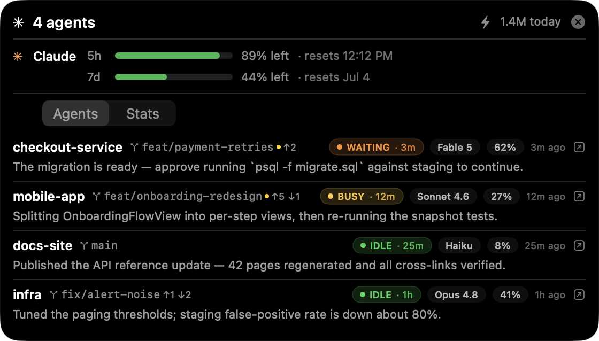
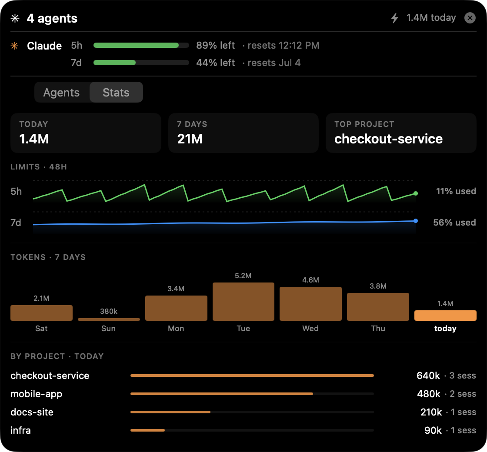

# Hub+

A floating HUD that monitors your local **Claude Code** sessions and your Claude
subscription usage — on **macOS** (a Dynamic-Island-style panel in the notch) and
**Windows** (a system-tray app with a floating panel).

> Independent, unofficial tool. **Not affiliated with or endorsed by Anthropic or Apple.**



**→ [Visual guide: how to use it](docs/USAGE.md)** · collapsed pill, expanded panel, Stats tab, and edge-docking.

## Features

- **Live session monitor (Agents tab)** — every running Claude Code session at a
  glance: status (idle / busy / waiting), model, context-window %, git repo + branch
  with ahead/behind (`↑2 ↓1`), and the last message. Sessions sort by urgency
  (waiting → error → busy → idle) and the status capsule shows how long the state
  has lasted (`BUSY · 12m`).
- **Subscription usage** — the 5h and 7d limit windows with % left, reset times, and
  a burn-rate (time-to-limit) projection.
- **Stats tab** — summary chips (today / 7 days / top project), a 48h history of both
  limit windows, per-day token bars for the last 7 days, and proportional per-project
  share bars — all derived from your local transcripts, counting real (input+output)
  tokens with the cache-inflated totals kept to tooltips.

  
- **macOS** — a notch "island": a collapsed pill that expands on hover/click, drags
  to any screen edge (snaps + reorients), a `⌃⌥H` global hotkey, and native
  notifications (agent finished / needs you / limit reached).
- **Windows** — a tray icon that toggles a borderless, always-on-top panel.

## How it works

Hub+ reads your **local** Claude Code data:

- `~/.claude` (macOS/Linux) or `%USERPROFILE%\.claude` (Windows): the live session
  registry (`sessions/<pid>.json`), per-session JSONL transcripts, and `stats-cache.json`.
- For usage limits it reads **your own** Claude Code OAuth token (macOS Keychain item
  `Claude Code-credentials`, or `~/.claude/.credentials.json` / Windows Credential
  Manager), **read-only**, and calls Anthropic's `GET /api/oauth/usage`.

Nothing leaves your machine except that one usage request to Anthropic. The token is
used for that request and never stored, logged, or forwarded. Transcript/tool text is
treated as untrusted and rendered inert.

## ⚠️ Disclaimer — please read

- This is a **personal, local** monitoring tool. It reads **your own** data and token,
  read-only, on **your own** machine.
- Anthropic reserves Claude **subscription** OAuth tokens for its first-party apps and
  **prohibits using them in third-party products or routing requests through them**.
  Hub+ does not run inference or route anyone's requests — it only reads your own usage
  numbers — but you use it **at your own risk** and are responsible for compliance with
  Anthropic's and Apple's terms. Do not operate it as a service or for anyone else.
- A fully ToS-clean mode (usage estimated **entirely** from local logs, with **no**
  network call) is on the roadmap.

## Build

### macOS
Requires Xcode and [XcodeGen](https://github.com/yonaskolb/XcodeGen).
```sh
xcodegen generate
xcodebuild -scheme HubPlus -configuration Release build
# or: open HubPlus.xcodeproj in Xcode and Run
```
Not sandboxed by design (it reads `~/.claude`, the keychain, and runs `git`), so it
**cannot ship on the Mac App Store** — install the built `HubPlus.app` directly.

To build a distributable `.dmg`, run `scripts/make-dmg.sh` (outputs to `dist/`).

### Windows
Requires the [.NET 8 SDK](https://dotnet.microsoft.com/download) and `git` on PATH.
```powershell
cd windows\HubPlusWin
dotnet build -c Release
# -> windows\HubPlusWin\bin\Release\net8.0-windows\HubPlus.exe
```

## Status & roadmap

- **macOS** — working: monitor, usage, Stats tab, notch island, drag-to-edge, hotkey,
  notifications.
- **Windows** — v1: tray + floating panel (pill/animation/edge-snap/notifications not yet ported).
- **Next** — Codex (and other agent) providers; launch + approve agents from the hub;
  fully-local usage-estimate mode.

## License

[MIT](LICENSE).
